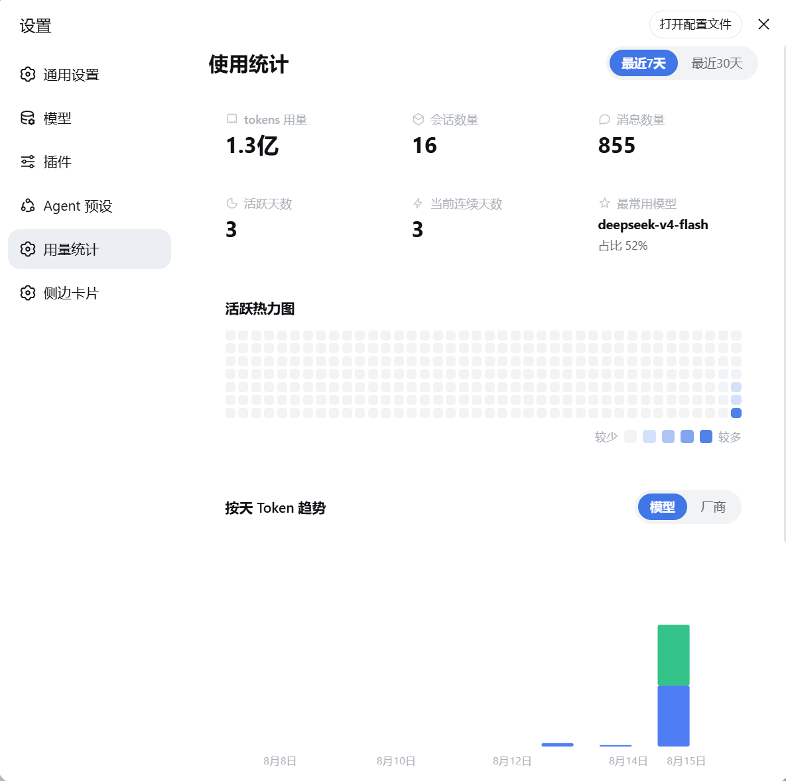
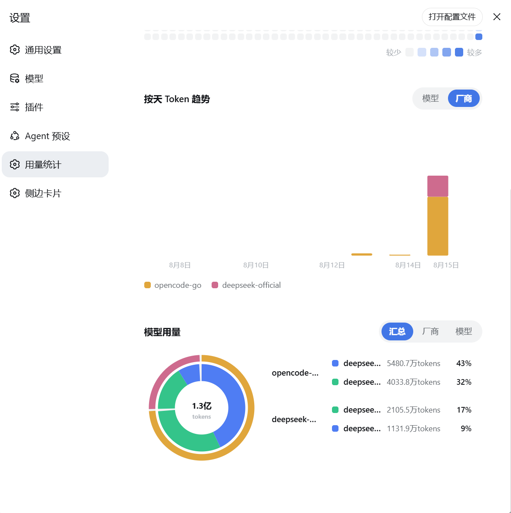

# dsh-usage-lens

DeepSeek Harness（DSH）Web UI 的**用量统计面板**。安装后，设置面板会新增「用量统计」页面，直观展示你的使用情况。

## 预览

<p align="center">
  
  
</p>

## 功能

- **总览卡片**：tokens 用量、会话数量、消息数量、活跃天数、当前连续天数、最常用模型。
- **活跃热力图**：GitHub 风格的 280 天活跃热力图，一眼看清使用节奏。
- **每日 Token 趋势**：按天查看 token 消耗，可切换「模型 / 厂商」视角。
- **模型用量双环饼图**：支持「汇总 / 厂商 / 模型」三种查看方式。

## 安装

```sh
dsh plugin --profile web add github:yokesky/dsh-usage-lens
```

安装后重启 web 服务，打开设置面板即可看到「用量统计」。

> 也可以从本地路径安装：`dsh plugin --profile web add <本仓库路径>`

## 数据说明

- 所有数据来自你本机的 DSH 会话记录，只在本地处理，不会上传到任何地方。
- 面板自动跟随 DSH 的亮色 / 暗色主题。

## License

MIT © 2026 yokesky
