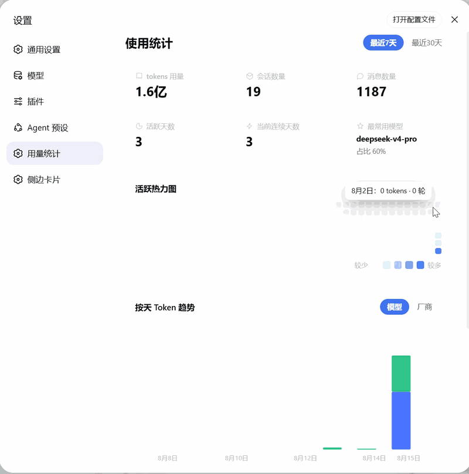

# dsh-usage-lens

[](https://www.npmjs.com/package/@yokesky/dsh-usage-lens)
[](./LICENSE)
[](https://github.com/yokesky/dsh-usage-lens)

DeepSeek Harness（DSH）Web UI 的**用量统计面板**，风格参考作者喜欢的 ZCode Harness 设计。
安装后，设置面板会新增「用量统计」页面，直观展示你的使用情况。

## 预览



<details>
<summary>静态截图</summary>


</details>

## 功能

- **总览卡片**：tokens 用量、会话数量、消息数量、活跃天数、当前连续天数、最常用模型。
- **活跃热力图**：GitHub 风格的 280 天活跃热力图，一眼看清使用节奏。
- **每日 Token 趋势**：按天查看 token 消耗，可切换「模型 / 厂商」视角。
- **模型用量双环饼图**：支持「汇总 / 厂商 / 模型」三种查看方式。

## 安装

### 方式一：npm 包

```sh
npm install -g @deepseek-ai/dsh   # 先安装 dsh CLI，然后才能执行 dsh 命令
dsh plugin --profile web add @yokesky/dsh-usage-lens
```

### 方式二：源码

```sh
# 需要已安装 dsh CLI（npm install -g @deepseek-ai/dsh），如已装可跳过
git clone https://github.com/yokesky/dsh-usage-lens.git
cd dsh-usage-lens
pnpm install
pnpm build
dsh plugin --profile web add link:<本仓库绝对路径>
```

> 说明：`link:` 方式指向本地源码，修改代码后重新 `pnpm build` 并重启 web 服务即可生效，无需重新安装。也可以直接从本仓库路径安装：`dsh plugin --profile web add <本仓库路径>`。

### 安装后

重启 web 服务，打开设置面板即可看到「用量统计」。

## English

A usage statistics dashboard for the DeepSeek Harness (DSH) Web UI. Once installed, a new **Usage Statistics** page appears in Settings.

**Features:** overview cards (tokens, sessions, messages, active days, current streak, top model), a 280-day GitHub-style activity heatmap, a daily token trend chart with model/provider views, and a model-usage donut chart with summary/provider/model modes.

**Install:**

```sh
npm install -g @deepseek-ai/dsh
dsh plugin --profile web add @yokesky/dsh-usage-lens
```

Restart the web service, then open **Settings → Usage Statistics**.

## 数据说明 / Privacy

- 所有数据来自你本机的 DSH 会话记录，只在本地处理，不会上传到任何地方。
- 面板自动跟随 DSH 的亮色 / 暗色主题。

All data is read from your local DSH session logs and processed locally — nothing is uploaded. The panel follows DSH's light / dark theme automatically.

## License

MIT © 2026 yokesky
